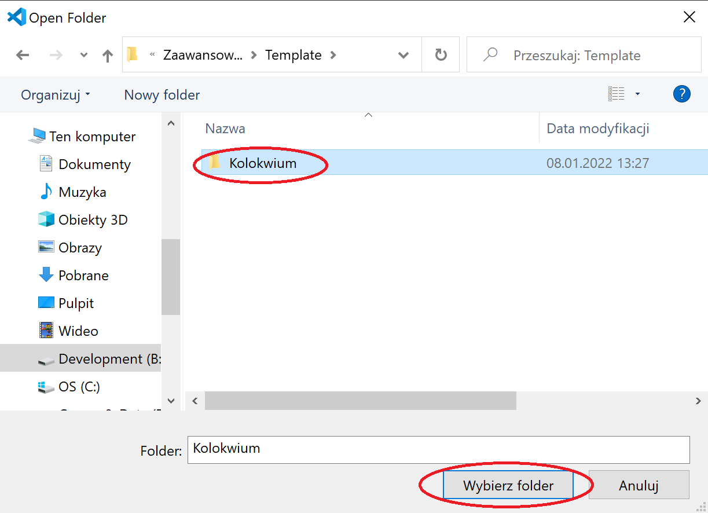
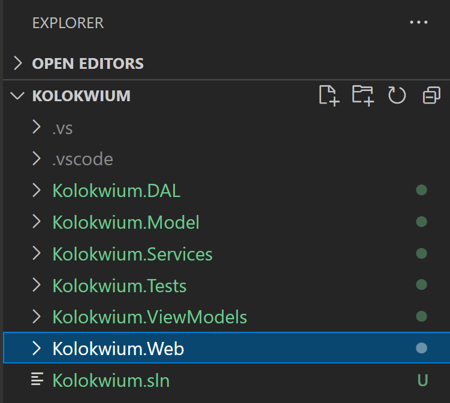

# Kolokwium
## Przygotowanie do kolokwium
### Pobranie i załadowanie dokumentacji
1) Proszę pobrać gałąź kolokwium w formie pliku zip. A następnie wypakować jego zawartość.
  </img>
2) Proszę uruchomić przeglądarkę i przejść pod adres: [https://devdocs.io/](https://devdocs.io/)
3) Następnie proszę przejść do `Preferences -> Import`.
  
  
4) Proszę wybrać plik `../Documentation/devdocs.json` znajdujący się w pobranym repozytorium.
  
5) W ostatnim kroku proszę się upewnić że wszystkie potrzebne pliki z dokumentacją są zainstalowane.
  
  
  

### Pobranie i przetestowanie szablonu kolokwium
1) Proszę otworzyć folder `Kolokwium` przy pomocy Visual Studio Code.

    </img>

    </img>

    </img>

2) Proszę otworzyć plik `Kolokwium.Web -> appsettings.json` a następnie podmienić wartość `Database` connection stringa podając swoje imię i nazwisko (bez znaków diakrytycznych) zamiast `{Imie_Nazwisko}`. Poniżej przykład dla Jana Kowalskiego. Dzięki temu w momencie pierwszej migracji utworzy się nowa baza danych zaczynającą się Państwa imieniem i nazwiskiem.
    ```json
    {
      "ConnectionStrings": {
        "DefaultConnection": "Server=(localdb)\\mssqllocaldb;Database=Jan_Kowalski_Kolowkium_ZPI_N_AppDb;Trusted_Connection=True;MultipleActiveResultSets=true"
      },
      "Logging": {
        "LogLevel": {
          "Default": "Information",
          "Microsoft": "Warning",
          "Microsoft.Hosting.Lifetime": "Information"
        }
      },
      "AllowedHosts": "*"
    }
    ```
3) Proszę w Visual Studio Code otworzyć nowy terminal `Terminal -> New Terminal`.
    
4) Nastepnie proszę pobrać wszystkie potrzebne biblioteki oraz skompilować całą solucję. W tym celu proszę wykonać poniższe polecenie.

    ```
    dotnet build
    ```
    
5) W celu weryfikacji poprawności działania aplikacji proszę ją uruchomić.

    ```
    dotnet run --project .\Kolokwium.Web\Kolokwium.Web.csproj
    ```

    Aplikacja powinna być dostępna pod adresem: [Link startowy](https://localhost:7000),
    [Link do aplikacji](https://localhost:44420)
    

    Web API powinno być dostępne pod adresem: `https://localhost:44420/api/{controller}` 

    Aplikacja Swagger jest dostępna pod adresem: [https://localhost:44420/swagger](https://localhost:44420/swagger).
    
    
6) Jeśli aplikacja działa poprawnie proszę zamknąć przy pomocy kombinacji klawiszy `ctrl + c`.

### Proszę przejść do wykonywania zadań

```diff
- Życzę Państwu powodzenia na kolokwium! :)
```

### Umieszenie rozwiązania w archiwum
1)  Po zakoczeniu pracy nad kolokwium proszę w folderze `Kolokwium` wykonać poniższe polecenia.
    ```powershell
    rmdir Kolokwium.Web/ClientApp/node_modules -recurse
    rmdir Kolokwium.Web/obj -recurse
    rmdir Kolokwium.Web/bin -recurse
    rmdir Kolokwium.ViewModels/obj -recurse
    rmdir Kolokwium.ViewModels/bin -recurse
    rmdir Kolokwium.Tests/obj -recurse
    rmdir Kolokwium.Tests/bin -recurse
    rmdir Kolokwium.Services/obj -recurse
    rmdir Kolokwium.Services/bin -recurse
    rmdir Kolokwium.DAL/obj -recurse
    rmdir Kolokwium.DAL/bin -recurse
    rmdir Kolokwium.Model/obj -recurse
    rmdir Kolokwium.Model/bin -recurse    
    
    ```
2)  Następnie proszę spakować rozwiązanie przy pomocy poniższego kodu. Plik `Rozwiazanie_Kolokwium.zip` będzie znajdował sie w folderze `Kolokwium`

    ```
    tar caf Rozwiazanie_Kolokwium.zip --exclude=./Rozwiazanie_Kolokwium.zip . 
    ```
    
3)  Proszę przejść pod adres [Archiver](http://ik2a.kik.pcz.czest.pl/archiver/TestArchive/Index)
4)  Następnie proszę wybrać Państwa test i kilknąć przycisk `Link`.

    
    
5)  Proszę wypełnić formularz podając swoje dane, wskazać plik `Rozwiazanie_Kolokwium.zip`, a następnie nacisnąc przycisk `Upload`

    
    
 
